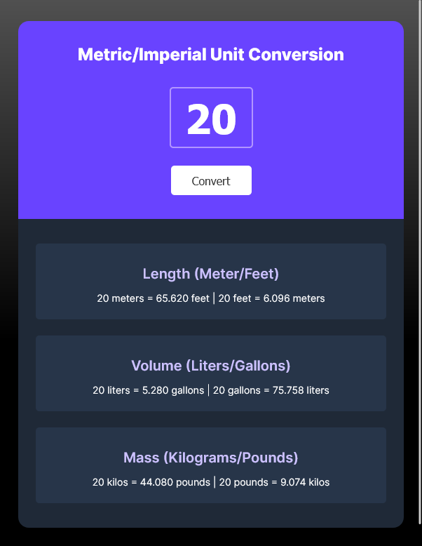
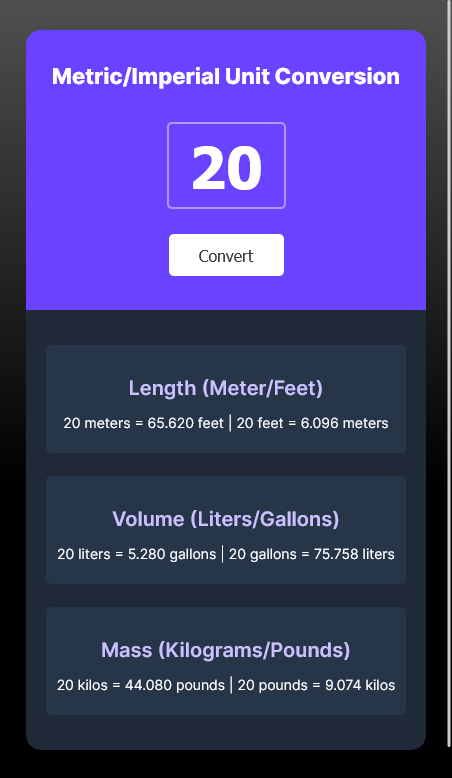

👋 Welcome! 👋 

## Table of contents

  - [Screenshot](#screenshot) 📷
  - [Links](#links) 🔗
  - [Built with](#built-with) 🔨
  - [Author](#author) 👽

### Screenshot

### Links 

🔗 Live Site URL: [https://unit-converter-excercise.netlify.app/](https://unit-converter-excercise.netlify.app/)

### Built with 

🔨 Semantic HTML5 markup

🔨 CSS custom properties

🔨 JavaScript

## Author 

👽 Netlify - [Alan](https://app.netlify.com/teams/alan77777777/overview)

👽 GitHub - [Alan77777777](https://github.com/Alan77777777)

👽 Frontend Mentor - [@Alan77777777](https://www.frontendmentor.io/profile/Alan77777777)
